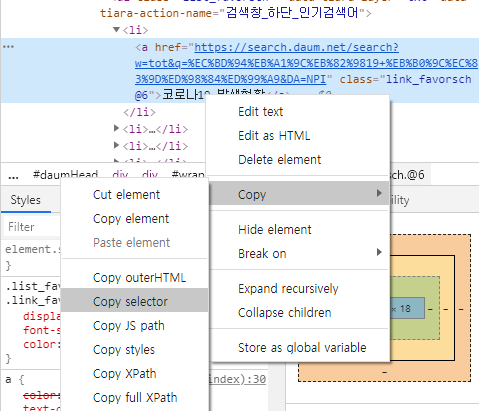

##### 다음 인기검색어 추출

___

1. 먼저 요청(Request)과 응답(Response)을 할 것이기에 requests를 사용하고, 텍스트로 나타나는 html을 우리가 사용하기 쉽게 바꿔주는 BeautilfulSoup를 import 한다.


```python
import requests
from bs4 import BeautifulSoup
```


2. url에 Daum 주소를 입력하고 BS를 이용해 data 변수에 저장한다.

```python
url = 'https://www.daum.net/'

response = requests.get(url).text
data = BeautifulSoup(response, 'html.parser')
```


3. 여기서 나는 인기검색어 값만 필요하기 때문에 인기검색어만 select할 것이다. Chrome창에서 F12를 누르면 개발자 도구 환경으로 들어갈 수 있다.

   > Chrome [ … -> 도구더보기 -> 개발자 도구]
   >
   > 로 들어갈 수도 있다.


커서 모양의 도구를 클릭한 후 원하는 지점(인기검색어)를 클릭한다.




정확히 원하는 Text위에 대고 copy -> copy selector로 복사를 한다.

정확히 원하는 위치에 대지 않을 경우 결과값이 다르게 나올 수 있다.


복사한 값은 다음과 같다.

```html
#wrapSearch > div.slide_favorsch > ul:nth-child(2) > li:nth-child(1) > a
```


인기검색어는 여러개일 것이므로 :nth-child() 값은 지우고 .select를 이용해 인기검색어만 선택하여 본다.

```python
select = data.select('#wrapSearch > div.slide_favorsch > ul > li > a')
```


이렇게 하면 select라는 __List__에 인기검색어 값들이 저장이 된다.


4. 마지막으로 인기검색어 값들을 반복문을 통해 출력한다. 하지만 인기검색어가 총 몇개있는지 알 수 없기에 select라는 List의 길이를 이용해 출력하도록 한다. List의 길이를 알고 싶으면 len() 함수를 사용한다.

```python
for i in range(len(select)):
    print(select[i].text)
```


